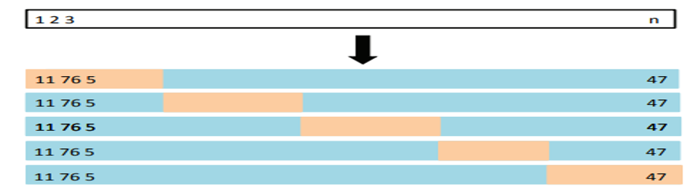
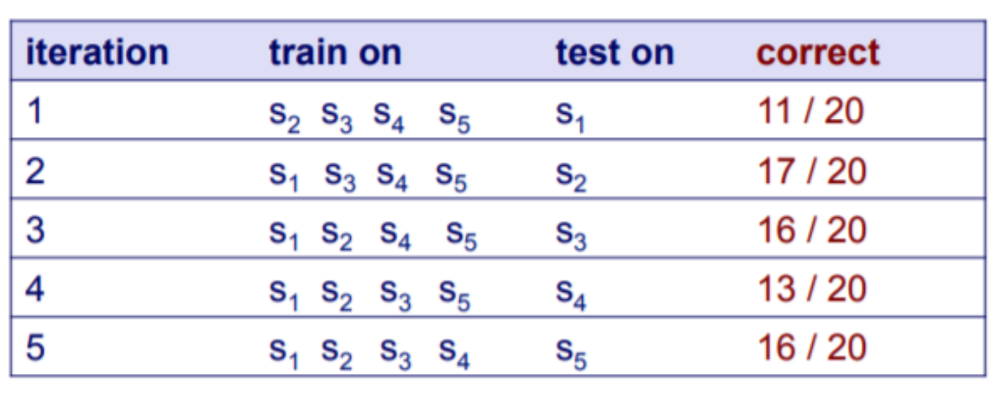

# Classifier-Weka

#### Ref: https://www.cs.waikato.ac.nz/ml/weka/courses.html
#### Ref: The slides from Rolf Schwitter, Carla P. Gomes, Bing Liu, KAU, David Page, and Paul Kennedy 

##  Training and testing - I

### Exercise -I
* Use "segment‐challenge.arff" as training set and "segment‐test.arff" as test set;
* Choose KNN with default K value;
* Output the accuracy;
* Evaluate on the training set.

##  Training and testing - Continuing

### Exercise -II
* Load "segment‐challenge.arff";
* 70% of "segment‐challenge.arff" is used as training set with the rest as test set;
* Choose KNN with default K value;
* Output the accuracy;
* Evaluate on the training set.

# Cross-Validation
* Widely used approach for estimating test error.
*  Estimates can be used to select best model, and to give an idea of the test error of the final chosen model.
*  Idea is to randomly divide the data into 𝑘 equal-sized parts. We leave out one part, fit the model to the other 𝑘 − 1 parts (combined), and then obtain predictions for the left-out part.
* This is done in turn for each part 1, 2, . . . 𝑘, and then the results are combined.

* A schematic display of 5-fold CV. A set of n observations is randomly split into five non-overlapping groups. Each of these fifths acts as a validation set (shown in beige), and the remainder as a training set (shown in blue). The test error is estimated by averaging the five resulting estimates.

* Cross-validation allows us to use (almost) all the training data to evaluate our model (most useful in low-data situations). 
10-fold or 5-fold is most commonly used.

### Exercise -III
Suppose we have 100 instances, and we want to estimate accuracy with cross validation. What is final accuary?
  

### Exercise -IV
* Load "segment‐challenge.arff";
* Use 10-CV to evaluate the model (KNN with default K value).
* Choose the best K value (1-10);
