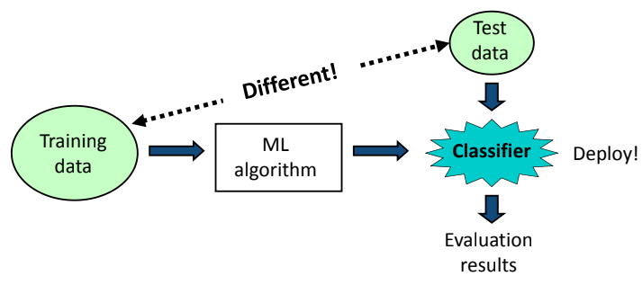
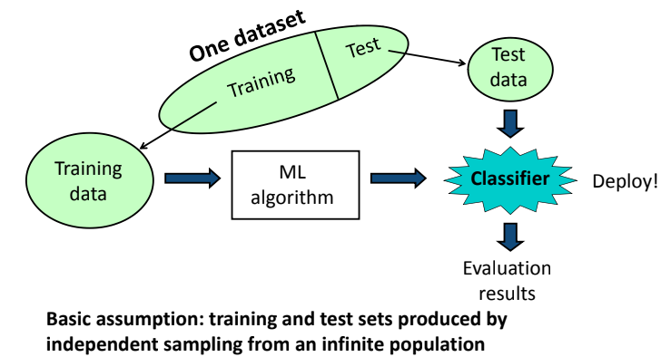

# Classifier-Weka

#### Ref: https://www.cs.waikato.ac.nz/ml/weka/courses.html
#### Ref: The slides from Rolf Schwitter, Carla P. Gomes, Bing Liu, KAU, David Page, and Paul Kennedy 

##  Training and testing - I

### Exercise -I
* Use "segment‐challenge.arff" as training set and "segment‐test.arff" as test set;
* Choose KNN with default K value;
* Output the accuracy;
* Evaluate on the training set.

##  Training and testing - Continuing

### Exercise -II
* Load "segment‐challenge.arff";
* 70% of "segment‐challenge.arff" is used as training set with the rest as test set;
* Choose KNN with default K value;
* Output the accuracy;
* Evaluate on the training set.

### Exercise -III
* Which feature(s) has the highest impact on the "Friendly"?
* Data source "Rabbit_Sydney_Data".
* What else knowledge do you discover via Weka?

